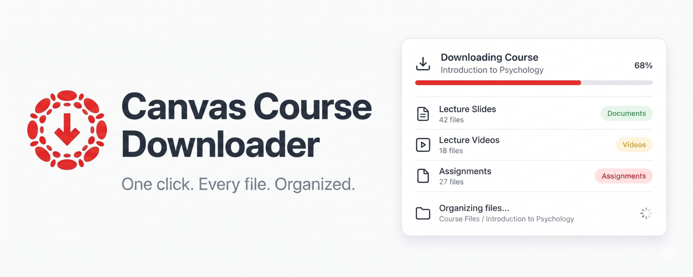
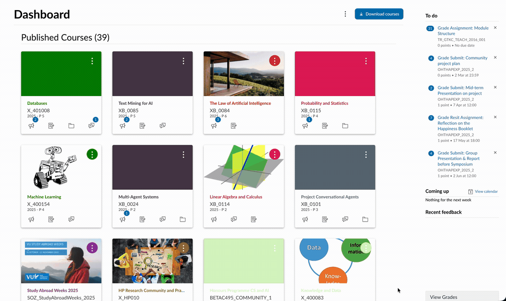
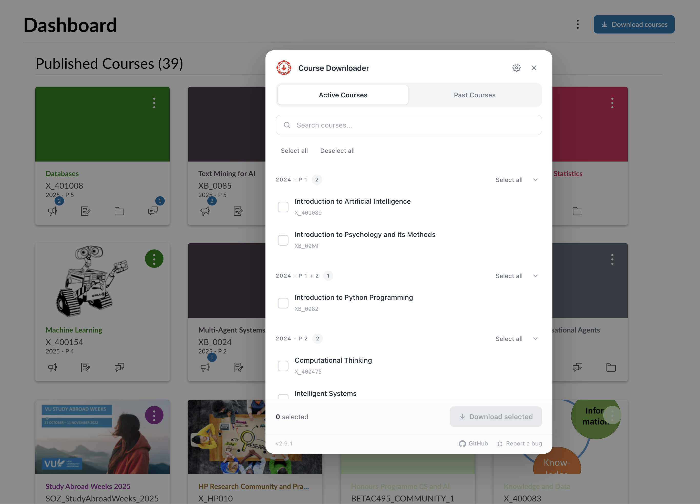
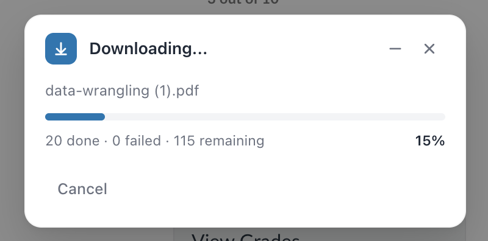
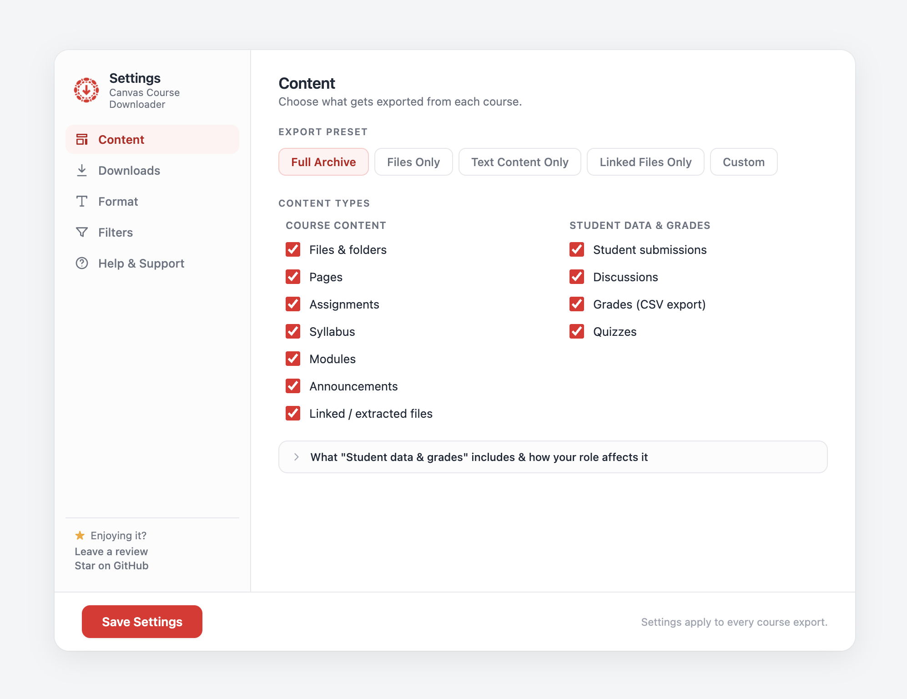

# Canvas Course Downloader

A browser extension that bulk-downloads and archives your Canvas LMS courses into organized folders — including teacher-side data like student submissions, gradebooks, and quiz results.

<p align="center">
  
</p>

<p align="center">
  Works on Chrome, Edge, Firefox, Brave, and other Chromium-based browsers.
</p>

<p align="center">
  If this saved you time, a ⭐ helps others find it.
</p>

## Why?

Canvas courses can disappear after a semester ends. Downloading files one at a time is tedious when you have hundreds across multiple courses, and existing tools all need API tokens or Python scripts. This extension uses your existing session cookies, so there's nothing to configure.

Having a local copy of your course materials also means you can feed them into AI tools — load everything into NotebookLM for study sessions, use an AI agent to help you review or summarize readings, or build a searchable knowledge base from an entire semester's worth of content.

If you teach, it doubles as an end-of-term archiving tool: it detects your instructor role and pulls in everything students can't see — every submission, the full gradebook, quiz results, and threaded discussions.

## Features

- Download everything from a single course, or select multiple courses from your dashboard
- Pick between active and past courses, grouped by term, with search filtering
- Bundle each course into a single `.zip` file instead of loose folders
- Incremental mode skips files you've already downloaded on previous runs
- Export your grades (and class averages!) as a CSV with assignment names, due dates, points, scores, and letter grades
- Export pages, assignments, announcements, and discussions as either HTML or Markdown
- Automatically detects whether you're a **student or teacher/TA** in each course and exports accordingly — no extra setup
- **Teacher mode:** download every student's submission (all attempts, in per-student folders), with a per-assignment grades CSV
- **Teacher mode:** full gradebook and student roster CSVs, complete threaded discussions, and rubric scores plus comments
- **Quizzes:** answer keys with per-student scores for teachers; your own score and answers as a student
- Filter out video files or cap the maximum file size to keep archives lean
- Cross-reference rewriting: links between exported pages, assignments, and files become relative paths so you can browse the course offline without dead Canvas links
- Pulls in pages that only appear inside Modules, plus their embedded slides / PDFs
- Finds files embedded in assignments, pages, announcements, and discussions that don't appear in the file browser
- Saves into organized subfolders per course with your original Canvas folder structure preserved
- Four built-in presets (Full Archive, Files Only, Text Only, Linked Only) plus custom configuration
- Configurable download throttling, file conflict handling, and folder prefix
- Keyboard shortcut: <kbd>Ctrl+Shift+D</kbd> (Mac: <kbd>Cmd+Shift+D</kbd>)
- Works with any Canvas instance, including self-hosted installations on custom domains
- No API tokens needed. Runs entirely in your browser with nothing sent to external servers

## Screenshots

### Demo

Selecting courses and downloading them, start to finish:



### Course selector

Pick which courses to download from your Canvas dashboard:



### Download progress



### Settings



## Installation

### Chrome Web Store

Install directly from the [Chrome Web Store](https://chromewebstore.google.com/detail/mmnmcnffbkcnhcjiidmdnaclpfeekiol). Also works on Edge and Brave.

### Manual install (Chrome / Edge / Brave)

1. Clone this repository:
   ```bash
   git clone https://github.com/jasp-nerd/canvas-course-downloader.git
   ```
2. Open your browser's extension page:
   - Chrome: `chrome://extensions`
   - Edge: `edge://extensions`
   - Brave: `brave://extensions`
3. Enable **Developer mode** (toggle in the top-right corner)
4. Click **Load unpacked** and select the cloned folder
5. Navigate to your Canvas site

### Firefox

1. Clone this repository
2. Open `about:debugging#/runtime/this-firefox`
3. Click **Load Temporary Add-on** and select the `manifest.json` file
4. Navigate to your Canvas site

> Firefox temporary add-ons expire when the browser restarts. You'll need to reload from `about:debugging` each session.

## Usage

### Single course

1. Go to any Canvas course page
2. Click the **"Download course content"** button that appears in the breadcrumb bar
3. Files download into organized folders named after the course

### Multiple courses

1. Go to your Canvas dashboard
2. Click **"Download courses"** in the header area
3. Use the **Active** and **Past Courses** tabs to find your courses
4. Search by course name, code, or term to narrow the list
5. Check the courses you want (or use "Select All" per term group)
6. Click **"Download selected"** and watch the progress bar

You can also trigger downloads from the extension popup icon or with the keyboard shortcut.

### Settings

Open settings from the extension popup or your browser's extension options page. Settings are organized into four tabs: **Content**, **Downloads**, **Format**, and **Filters**.

| Setting | What it does |
| --- | --- |
| Content types | Toggle what to export, split into two groups — *Course content*: files, pages, assignments, syllabus, modules, announcements, linked/extracted files; *Student data & grades*: student submissions, discussions, grades, quizzes |
| Presets | Quick-select common combos: Full Archive, Files Only, Text Content Only, Linked Files Only |
| File conflict handling | Choose Rename (add a number suffix) or Overwrite when a file already exists |
| Download throttle | Delay between downloads in milliseconds (default 250, range 50–5000) |
| Folder prefix | Custom string prepended to all download paths |
| ZIP bundling | Bundle each course into a single `.zip` file (on by default; falls back to loose files above ~1.5 GB) |
| Incremental mode | Track what's been downloaded per course and skip those files next time |
| Export format | HTML (default) or Markdown — Markdown is best for Obsidian, Notion, or LLM ingestion |
| Filters | Exclude video files (`.mp4`, `.mov`, `.mkv`, …) and/or cap the maximum file size in MB |

## Supported content

| Content type | What gets downloaded |
| --- | --- |
| Files | All files from the course file browser, preserving the original folder hierarchy |
| Pages | Every wiki page saved as an HTML (or Markdown) file |
| Assignments | Each assignment with its description, due date, and rubric definition |
| Announcements | Course announcements with dates |
| Discussions | Discussion topics. Teachers/TAs get the full threaded replies and reply attachments; students get the opening post |
| Modules | Module structure overview plus any files referenced within modules |
| Syllabus | The course syllabus |
| Grades | Students get a personal `Grades.csv` (your scores plus class Low/Lower-quartile/Median/Mean/Upper-quartile/High stats). Teachers/TAs get a full `Gradebook.csv` (every student × assignment) and a `Students.csv` roster |
| Student submissions | *Teacher/TA:* every student's work for each assignment — all attempts, organized as `Submissions/<Assignment>/<Student>/`, with a per-assignment `_grades.csv` and rubric feedback. *Student:* your own submissions and attempt history |
| Quizzes | Quiz metadata and description for everyone. *Teacher/TA:* the question bank with answer key plus a per-student score table and `_grades.csv`. *Student:* your score and (when the instructor left responses visible) your answered questions |
| Linked files | Files embedded in page/assignment/announcement/discussion HTML that don't appear in the file browser, including inline images |

Each export also includes a `manifest.json` with metadata: export date, file counts per type, source URL, and extension version.

## Exported folder structure

```
Course Name/
├── Files/
│   ├── Lecture Slides/
│   │   ├── week1.pdf
│   │   └── week2.pdf
│   └── Readings/
│       └── chapter1.pdf
├── Pages/
│   ├── course-overview.html
│   └── resources.html
├── Assignments/
│   ├── Homework-1.html
│   └── Final-Project.html
├── Announcements/
│   └── Welcome-to-class.html
├── Discussions/
│   └── Introduce-yourself.html
├── Quizzes/
│   └── Midterm/
│       ├── Midterm.html
│       └── _grades.csv               # teacher only
├── Submissions/                      # teacher only
│   └── Homework 1/
│       ├── Alice Smith/
│       │   ├── Attempt 1 - essay.pdf
│       │   └── submission.html       # grade, rubric, comments
│       └── _grades.csv
├── Modules/
│   └── Week 1/
│       └── handout.pdf
├── Extracted_Files/
│   └── embedded-image.png
├── Modules.html
├── Syllabus.html
├── Grades.csv                        # personal grades (student)
├── Gradebook.csv                     # teacher only — every student × assignment
├── Students.csv                      # teacher only — roster
├── Grading Weights.html              # when the course uses weighted groups
├── styles.css                        # Built-in stylesheet linked from every exported HTML
└── manifest.json
```

The teacher-only entries (`Submissions/`, `Gradebook.csv`, `Students.csv`, the quiz answer keys, full discussion threads) only appear when you have an instructor, TA, or designer role in the course. Student exports omit them.

In ZIP mode, the same structure is bundled into a single `Course Name.zip`. In Markdown export mode, all generated documents end in `.md` instead of `.html` and the `styles.css` file is omitted.

## How it works

The content script runs on every HTTPS page but immediately exits if it doesn't detect Canvas (it checks for Instructure domains and Canvas-specific DOM elements like `#application`, `.ic-app`, and the CSRF meta tag). On Canvas pages, it calls the Canvas REST API using your session cookies and follows pagination via RFC 5988 Link headers.

It also checks your enrollment in the course. When you have a teacher, TA, or designer role, it unlocks the instructor-only endpoints (student submissions, full discussion threads, the gradebook, quiz answer keys) — these are skipped entirely for students, so a student export only ever contains your own data.

Beyond the normal file list, it parses HTML content from pages, assignments, announcements, and discussions to extract linked files and inline images that aren't in the file browser, saving them under `Extracted_Files/`. Files get queued in the background service worker, which downloads them sequentially with configurable throttling. Failed downloads are retried with exponential backoff (up to 3 attempts) and can be retried manually from the progress panel.

## Folder structure

```
canvas-course-downloader/
├── manifest.json        # Extension manifest (MV3)
├── background.js        # Service worker: sequential download queue
├── content.js           # Entry point, SPA navigation handling, message routing
├── downloader.js        # Download orchestration, ZIP bundling, settings
├── ui.js                # UI components: buttons, progress panel, course selector, toasts
├── canvas-api.js        # Canvas REST API: fetch with retry, pagination, timeouts
├── detector.js          # Canvas page and course detection
├── helpers.js           # Pure utilities: sanitization, parsing, color math
├── client-zip.min.js    # client-zip library (streaming ZIP generator)
├── turndown.min.js      # turndown (HTML → Markdown) for the Markdown export mode
├── turndown-plugin-gfm.min.js  # GFM tables / strikethrough plugin for turndown
├── popup.html / js      # Extension popup
├── options.html / js    # Settings page
├── icons/               # Extension icons (SVG + PNG at 16, 48, 128)
├── screenshots/         # Store and documentation images
└── tests/
    └── test-helpers.html  # Browser-based unit tests for helper functions
```

## Permissions

The content script is injected on every HTTPS page (`https://*/*`) because Canvas can be hosted on any domain — universities often run it on their own URLs like `canvas.university.edu`. The script needs to load everywhere to detect Canvas instances, but it exits immediately on non-Canvas pages and makes no network requests outside the Canvas site you're on. Elevated host permissions are scoped narrowly to `*://*.instructure.com/*`; on self-hosted instances the extension works through same-origin requests from the page itself.

For the full privacy policy, see [PRIVACY.md](PRIVACY.md).

## Known limitations

- Content hosted by third-party LTI tools (Turnitin, Panopto, external videos) lives outside Canvas and can't be downloaded
- You must be logged into Canvas. There's no API-token or headless mode
- Pages, assignments, announcements, and discussions are saved as HTML summaries, not pixel-perfect copies of the Canvas layout
- Heavily customized Canvas themes may affect button placement or page detection
- Courses with hundreds of files will take a few minutes. The throttle setting helps balance speed against browser download limits
- Teacher exports that include every student's submission can be large and slow; above ~1.5 GB, ZIP bundling automatically falls back to individual file downloads
- Windows paths are truncated to stay under the 260-character limit, which can shorten long filenames

## Troubleshooting

**"Not on a Canvas page"** — The extension didn't detect Canvas on the current page. Make sure you're on a page with Canvas navigation elements. On self-hosted instances with heavy theme customizations, detection can fail. File an issue with details about your Canvas URL.

**Course selector is empty** — No courses came back from the API. Try the **Past Courses** tab for completed semesters. Some institutions restrict API access for certain enrollment roles.

**Downloads blocked by browser** — Browsers may block bulk downloads the first time. Click **Allow** when prompted. If downloads are timing out, lower the throttle value in settings.

**Some files are missing** — Files in restricted areas or behind additional permission checks may not be accessible through the API. Files hosted by external LTI tools won't be captured. Check the browser console for specific errors.

**Firefox add-on expired** — Firefox temporary add-ons only last until browser restart. Reload from `about:debugging#/runtime/this-firefox`.

## Contributing

See [CONTRIBUTING.md](CONTRIBUTING.md).

## License

[MIT](LICENSE)
